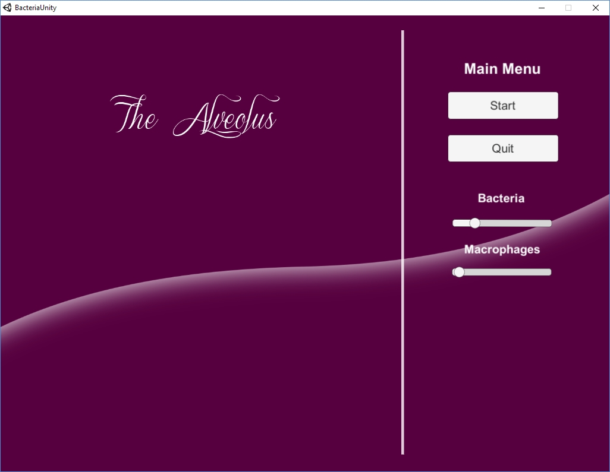
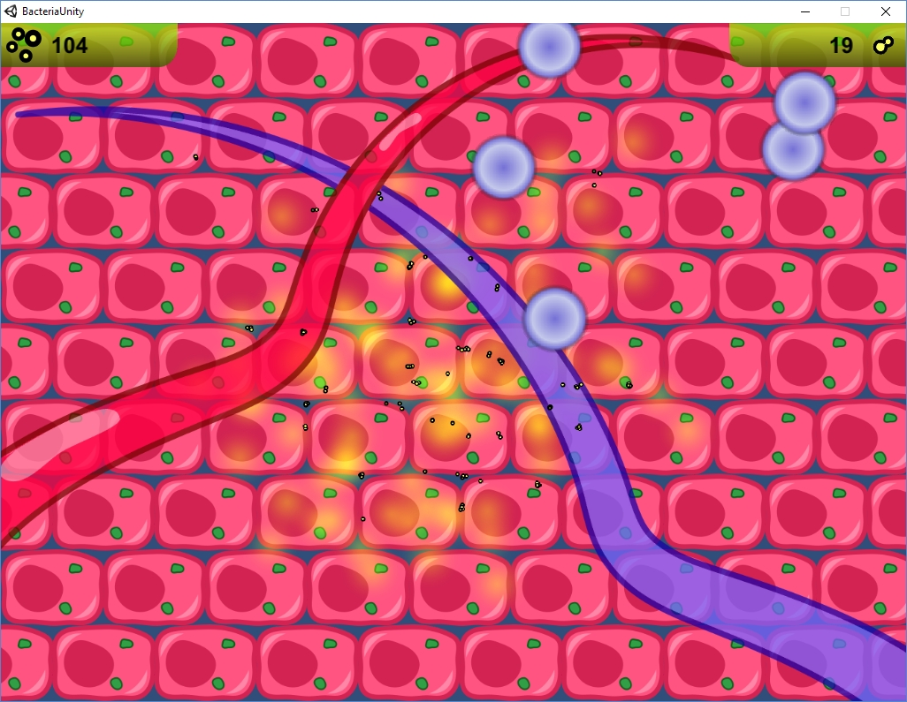

# Alveolus game
This project is a adaption of Dr. Guido Santos MATLAB implementation of a bacterial pneumococcal pneumonia infection [missing reference].

# Prerequirements
* [Unity](https://unity3d.com/)
* [Visual Studio 2017](https://www.visualstudio.com)

# Build
Open the BacteriaUnity folder in Unity and run from there

# Screenshots

__Main menu__

__In game view__

# Credits
The main code is based on [Guido Santos'](http://gsantos.weebly.com/) work. It will be used for the [Game infection hack 2017](http://gaminfectionhack.weebly.com/)
